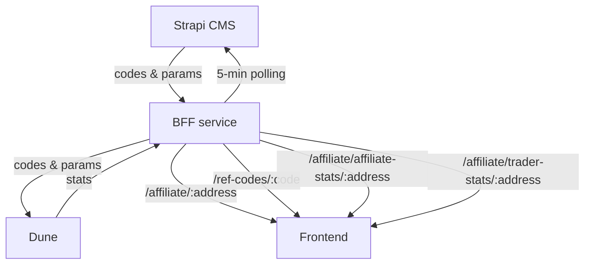

# Affiliate program (partners + traders)

## 1) Purpose

The affiliate program will amplify word-of-mouth marketing for CoW Swap by incentivizing referrals. Its mechanic will also facilitate a slew of other marketing tactics including KOL (influencer) and publisher activation, low funnel offers (e.g. with social and display ads), and high funnel measurement (e.g. with podcast and OOH ads).

## 2) Actors

- Traders
- Partners or Affiliates (KOLs/influencers, publishers)
- Program managers (Marketing Squad)
- Accountants (Finance Squad)
- Maintainers (Web Squad, DevOps Squad)

## 3) Feature flag

- Gated by a LaunchDarkly feature flag called `isAffiliateProgramEnabled`
- When enabled:
  1.  two new pages show up in `Account`, i.e. `My Rewards` and `Affiliate`
  2.  the referral code input row shows up in the trade form alongside a Modal to input the code

## 4) Data flow

- CMS is source of truth for codes
- Dune is the source of truth for volumes, payouts and eligibility
- BFF checks CMS every 5 minutes for new/updated codes
- Dune is used for accounting
- Frontend relies on BFF and does not call Dune/CMS directly



## 5) Codes

- Immutable (except for the `enabled` flag) to keep accounting simple
- Unique code per partner (1:1 mapping)
- If a partner needs multiple codes, they must use multiple wallets
- You can bypass the immutability by deleting and recreating the code, please avoid doing this!!

## 5.1) Disabling codes

- Program managers can soft-disable a code using the CMS Admin dashboard
- This stops new sign-ups that go through our frontend
- This does not affect historical payouts
- It can be bypassed by traders that do not use our frontend

## 5.2) Default params + updates

- Maintainers can change the program defaults by updating the CMS environment variables:
  1. Tweak params in `/workspaces/infrastructure/cms/index.ts`
  2. Run `pulumi up` in `/workspaces/infrastructure/cms` (after ssologin, pulumi stack select)

- CMS env defaults:
  - `AFFILIATE_REWARD_AMOUNT` = `20`
  - `AFFILIATE_TRIGGER_VOLUME` = `250000`
  - `AFFILIATE_TIME_CAP_DAYS` = `90`
  - `AFFILIATE_VOLUME_CAP` = `0` (unlimited)
  - `AFFILIATE_REVENUE_SPLIT_AFFILIATE_PCT` = `50`
  - `AFFILIATE_REVENUE_SPLIT_TRADER_PCT` = `50`
  - `AFFILIATE_REVENUE_SPLIT_DAO_PCT` = `0`

## 5.3) Special codes

- Program managers can create a new code from the CMS dashboard with special parameters by specifying any of the following:
  `REWARD_AMOUNT, TRIGGER_VOLUME, TIME_CAP_DAYS, VOLUME_CAP, REVENUE_SPLIT_AFFILIATE_PCT, REVENUE_SPLIT_TRADER_PCT, REVENUE_SPLIT_DAO_PCT`
- Program managers can also a new code from the CMS dashboard with default parameters by leaving the above fields empty.
- Important: if you create a code in CMS it might take up to 5 minutes to show up in the BFF due to polling interval.

## 6) Partner privacy

Goal: protect partner privacy by not leaking wallet addresses

Audit:

- Ensure FE uses a CMS key that cannot read the affiliate collection
- Ensure BFF strips partner address from `/ref-codes/:code` (called by traders)
- Ensure CMS disallows reading the affiliate collection without API key

## 6.1) Revenue splits privacy

Goal: protect revenue splits by not leaking them to traders

Audit:

- BFF strips revenue split fields from `/ref-codes/:code`, instead it only returns `traderRewardAmount`
- This is calculated as `rewardAmount * revenueSplitTraderPct / 100`

## 7) Eligibility

- New traders only (hard requirement); allowing existing traders is non-trivial
- FE checks prior orders and informs users if they are eligible
- Dune filters out ineligible traders
- Low fee swaps do not count towards eligible volume (see `min_fee_bps` in the dune queries)
- FE can fail to determine the eligibility. It reads historical orders from the orderbook API via `useOrdersFromOrderBook`. If the orderbook fetch fails or takes longer than 30s, the wallet eligibility is marked as unknown and the modal shows a warning message explaining rewards may not apply.

## 8) Environments

Staging:

- BFF: <https://bff.barn.cow.fi>
- CMS: <https://cms.barn.cow.fi/admin>
- FE: <https://staging.swap.cow.fi>
- DUNE_QUERY_ID_TRADER_STATS: `6648679`
- DUNE_QUERY_ID_AFFILIATE_STATS: `6648689`
- DUNE_AFFILIATE_PROGRAM_TABLE_NAME: `affiliate_program_data_staging`

```sh
curl -s "https://bff.barn.cow.fi/ref-codes/FOOBAR"
curl -s "https://bff.barn.cow.fi/affiliate/0x6fc1Fb2e17DFf120fa8F838af139aF443070Fd0E"
curl -s "https://bff.barn.cow.fi/affiliate/affiliate-stats/0x6fc1Fb2e17DFf120fa8F838af139aF443070Fd0E"
curl -s "https://bff.barn.cow.fi/affiliate/trader-stats/0x6fc1Fb2e17DFf120fa8F838af139aF443070Fd0E"
```

Production:

- BFF: <https://bff.cow.fi>
- CMS: <https://cms.cow.fi/admin>
- FE: <https://swap.cow.fi>
- DUNE_QUERY_ID_TRADER_STATS: `6560853`
- DUNE_QUERY_ID_AFFILIATE_STATS: `6560325`
- DUNE_AFFILIATE_PROGRAM_TABLE_NAME: `affiliate_program_data`

## 9) Payouts

- Payouts happen on Mainnet only, using USDC
- Very very important: payouts must be done from 2 different wallets. One for partners and one for traders. Otherwise the math breaks.
- Using a SafeWallet you can created Nested Safes and label them accordingly: `affiliate payouts` and `trader payouts`.
- After having the payout wallet addresses you need to paste them in the Dune dashboards, both `Affiliate Overview` and `Traders Overview`
- The dune dashboard will check USDC transfers from those wallets and compute what was already paid out and what is pending payout.
- From two other dashboards, `Next payouts for affiliates` and `Next payouts for traders`, you can export a CSV file with the pending payouts with you can drop into Safe's CSV Airdrop app. (it takes a few minutes for the dashboards to reflect new payouts)

## 10) File structure

- Besides this README, there is also a `/apps/cowswap-frontend/src/modules/affiliate/SPEC.md` file with use-cases (useful for AGENTS).
- The Dune queries are version controlled in `/apps/cowswap-frontend/src/modules/affiliate/misc`.
