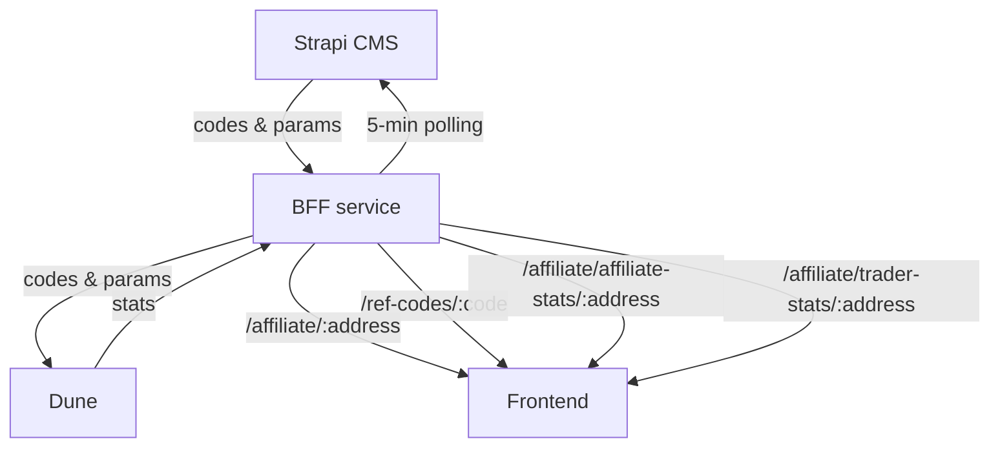

# Affiliate program (partners + traders)

## 1) Purpose

The affiliate program will amplify word-of-mouth marketing for CoW Swap by incentivizing referrals. Its mechanic will also facilitate a slew of other marketing tactics including KOL (influencer) and publisher activation, low funnel offers (e.g. with social and display ads), and high funnel measurement (e.g. with podcast and OOH ads).

## 1.5) Feature flag

- Gated by LaunchDarkly flag `isAffiliateProgramEnabled`
- When disabled, hide affiliate + rewards hub routes and menu links, block referral deep links, skip affiliate modals/banners, and omit referrer payload from appData

## 2) Actors

- Traders
- Partners (affiliates/KOLs, publishers)
- Program managers (Marketing Squad)
- Accountants (Finance Squad)
- Maintainers (Web Squad, DevOps Squad)

## 3) Data flow

- CMS is source of truth
- BFF checks CMS every 5 minutes for new/updated codes
- Dune is used for accounting
- Frontend relies on BFF and does not call Dune/CMS directly



## 4) Codes

- Immutable (except the `enabled` flag) to keep accounting simple
- Unique code per affiliate (1:1 mapping)
- If an affiliate needs multiple codes, they must use multiple wallets

## 5) Disabling codes

- Program managers can soft-disable a code using the CMS Admin dashboard
- This stops new sign-ups that go through our frontend
- This does not affect historical payouts
- It can be bypassed by traders that do not use our frontend

## 6) Partner privacy

Goal: protect partner privacy by not leaking wallet addresses

Audit:

- Ensure FE uses a CMS key that cannot read the affiliate collection
- Ensure BFF strips partner address from `/ref-codes/:code` (called by traders)
- Ensure CMS disallows reading the affiliate collection without API key

## 7) Eligibility (hard requirement) TODO

- New traders only; allowing existing traders is non-trivial
- FE checks prior orders from local cache only (last ~100, chain-scoped)
- False-eligible possible if cache stale/missing history
- First-ever trade must be ref trade to bind in analytics

## 8) Default params + updates

- Defaults live in Strapi CMS config/env; applied on create only; existing codes immutable
- Update flow: change CMS env defaults -> deploy CMS -> create new affiliate/code (CMS or BFF) to pick up new defaults
- CMS env defaults (name = default):
  - `AFFILIATE_REWARD_AMOUNT` = `20`
  - `AFFILIATE_TRIGGER_VOLUME` = `250000`
  - `AFFILIATE_TIME_CAP_DAYS` = `90`
  - `AFFILIATE_VOLUME_CAP` = `0`
  - `AFFILIATE_REVENUE_SPLIT_AFFILIATE_PCT` = `50`
  - `AFFILIATE_REVENUE_SPLIT_TRADER_PCT` = `50`
  - `AFFILIATE_REVENUE_SPLIT_DAO_PCT` = `0`

## 9) Params exposure + networks

- Traders only see `traderRewardAmount/triggerVolume/timeCapDays/volumeCap`
- Affiliates see full splits + reward amount
- `GET /ref-codes/:code` -> `{ code, traderRewardAmount, triggerVolume, timeCapDays, volumeCap }`
- `GET /affiliate/:address` -> `{ code, rewardAmount, triggerVolume, timeCapDays, volumeCap, revenueSplitAffiliatePct, revenueSplitTraderPct, revenueSplitDaoPct }`
- Supported chains list includes L2s + Sepolia (not mainnet-only in FE)

## 10) Analytics + payouts + debug

- Special codes (custom params) must be created in CMS
- 5-min poller uploads CMS codes into Dune
- Dune payouts: USDC mainnet only; time/volume caps enforced; `volume_cap=0` unlimited
- FE typed data includes only `walletAddress + code + chainId` (no nonce/expiry)
- `DEBUG*` codes simulate statuses for testing/demo

## 11) File map (high level)

- `apps/cowswap-frontend/src/modules/affiliate/README.md`: product + data-flow overview; keep up to date.
- `apps/cowswap-frontend/src/modules/affiliate/SPEC.md`: spec checklist for partner/trader flows and analytics requirements.
- `apps/cowswap-frontend/src/modules/affiliate/config/constants.ts`: shared constants (storage keys, URLs, supported networks).
- `apps/cowswap-frontend/src/modules/affiliate/api/index.ts`: BFF API entry point + supported-network helper.
- `apps/cowswap-frontend/src/modules/affiliate/api/bffAffiliateApi.ts`: BFF client; all partner + trader requests live here.
- `apps/cowswap-frontend/src/modules/affiliate/lib/affiliate-program-utils.ts`: shared formatting, typed data builder, referral-code helpers.
- `apps/cowswap-frontend/src/modules/affiliate/lib/affiliate-program-utils.test.ts`: unit tests for referral-code helpers.
- `apps/cowswap-frontend/src/modules/affiliate/model/partner-trader-types.ts`: core types for partner stats + trader referral-code state.
- `apps/cowswap-frontend/src/modules/affiliate/model/state/TraderReferralCodeContext.tsx`: context/provider + actions for trader referral-code state.
- `apps/cowswap-frontend/src/modules/affiliate/model/state/traderReferralCodeReducers.ts`: pure reducers for referral-code state transitions.
- `apps/cowswap-frontend/src/modules/affiliate/model/state/traderReferralCodeStorage.ts`: localStorage sync for saved referral codes.
- `apps/cowswap-frontend/src/modules/affiliate/model/hooks/useTraderReferralCode.ts`: access trader referral-code context.
- `apps/cowswap-frontend/src/modules/affiliate/model/hooks/useTraderReferralCodeActions.ts`: access referral-code actions only.
- `apps/cowswap-frontend/src/modules/affiliate/model/hooks/useTraderReferralCodeModalState.ts`: derive modal UI state from referral-code state.
- `apps/cowswap-frontend/src/modules/affiliate/model/hooks/useTraderReferralCodeWalletSync.ts`: wallet eligibility + network sync.
- `apps/cowswap-frontend/src/modules/affiliate/model/containers/TraderReferralCodeController.tsx`: wires verification + wallet sync for traders.
- `apps/cowswap-frontend/src/modules/affiliate/model/containers/TraderReferralCodeDeepLinkHandler.tsx`: handles `?ref=` deep links.
- `apps/cowswap-frontend/src/modules/affiliate/model/containers/verificationEffects.ts`: hooks for auto-verify + pending verify flows.
- `apps/cowswap-frontend/src/modules/affiliate/model/containers/verificationLogic.ts`: verification pipeline + BFF response handling.
- `apps/cowswap-frontend/src/modules/affiliate/ui/shared.tsx`: shared cards/layout bits + terms/FAQ links.
- `apps/cowswap-frontend/src/modules/affiliate/ui/TraderReferralCodeNetworkBanner.tsx`: banner for unsupported wallet/network.
- `apps/cowswap-frontend/src/modules/affiliate/ui/TraderReferralCodeIneligibleCopy.tsx`: ineligible copy + “How it works” link.
- `apps/cowswap-frontend/src/modules/affiliate/ui/TraderReferralCodeInput/index.ts`: exports for referral-code input row (partner/trader).
- `apps/cowswap-frontend/src/modules/affiliate/ui/TraderReferralCodeInput/TraderReferralCodeInputRow.tsx`: referral-code input UI row.
- `apps/cowswap-frontend/src/modules/affiliate/ui/TraderReferralCodeInput/styles.ts`: styles for referral-code input row.
- `apps/cowswap-frontend/src/modules/affiliate/ui/TraderReferralCodeModal.tsx`: modal shell for trader referral-code flow.
- `apps/cowswap-frontend/src/modules/affiliate/ui/TraderReferralCodeModal/TraderReferralCodeModalContent.tsx`: modal content layout + copy.
- `apps/cowswap-frontend/src/modules/affiliate/ui/TraderReferralCodeModal/TraderReferralCodeForm.tsx`: modal form logic + actions.
- `apps/cowswap-frontend/src/modules/affiliate/ui/TraderReferralCodeModal/TraderReferralCodeStatusMessages.tsx`: status UI + modal title.
- `apps/cowswap-frontend/src/modules/affiliate/ui/TraderReferralCodeModal/types.ts`: modal prop types + CTA definitions.
- `apps/cowswap-frontend/src/modules/affiliate/ui/TraderReferralCodeModal/useTraderReferralCodeModalController.ts`: modal controller wiring.
- `apps/cowswap-frontend/src/modules/affiliate/ui/TraderReferralCodeModal/traderReferralCodeModal.helpers.tsx`: CTA + analytics helpers.
- `apps/cowswap-frontend/src/modules/affiliate/ui/TraderReferralCodeModal/styles/index.ts`: re-exports for modal styles.
- `apps/cowswap-frontend/src/modules/affiliate/ui/TraderReferralCodeModal/styles/layout.ts`: modal layout styles.
- `apps/cowswap-frontend/src/modules/affiliate/ui/TraderReferralCodeModal/styles/form.ts`: modal form styles.
- `apps/cowswap-frontend/src/modules/affiliate/ui/TraderReferralCodeModal/styles/status.ts`: modal status styles.
- `apps/cowswap-frontend/src/modules/affiliate/misc/affiliates.sql`: partner metrics query (Dune).
- `apps/cowswap-frontend/src/modules/affiliate/misc/traders.sql`: trader metrics query (Dune).
- `apps/cowswap-frontend/src/modules/affiliate/misc/traders_debug.sql`: trader eligibility debug query (Dune).

## Environments

Staging:
- BFF: <https://bff.barn.cow.fi>
- CMS: <https://cms.barn.cow.fi/admin>
- FE: <https://staging.swap.cow.fi>
- DUNE_QUERY_ID_TRADER_STATS: `6648679`
- DUNE_QUERY_ID_AFFILIATE_STATS: `6648689`
- DUNE_AFFILIATE_PROGRAM_TABLE_NAME: `affiliate_program_data_staging`

```sh
curl -s "https://bff.barn.cow.fi/ref-codes/FOOBAR"
curl -s "https://bff.barn.cow.fi/affiliate/0x6fc1Fb2e17DFf120fa8F838af139aF443070Fd0E"
curl -s "https://bff.barn.cow.fi/affiliate/affiliate-stats/0x6fc1Fb2e17DFf120fa8F838af139aF443070Fd0E"
curl -s "https://bff.barn.cow.fi/affiliate/trader-stats/0x6fc1Fb2e17DFf120fa8F838af139aF443070Fd0E"
```

Production:
- BFF: <https://bff.cow.fi>
- CMS: <https://cms.cow.fi/admin>
- FE: <https://swap.cow.fi>
- DUNE_QUERY_ID_TRADER_STATS: `6560853`
- DUNE_QUERY_ID_AFFILIATE_STATS: `6560325`
- DUNE_AFFILIATE_PROGRAM_TABLE_NAME: `affiliate_program_data`

## Changing program params

1. Tweak params in `/workspaces/infrastructure/cms/index.ts`
2. Run `pulumi up` in `/workspaces/infrastructure/cms` (after ssologin, pulumi stack select)
