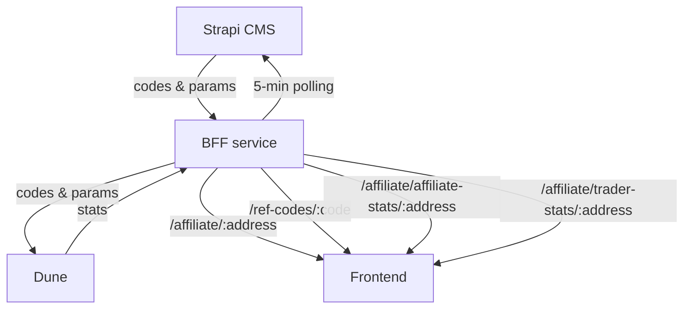

# Affiliate program

## 1) Purpose

The affiliate program will amplify word-of-mouth marketing for CoW Swap by incentivizing referrals. Its mechanic will also facilitate a slew of other marketing tactics including KOL (influencer) and publisher activation, low funnel offers (e.g. with social and display ads), and high funnel measurement (e.g. with podcast and OOH ads).

## 2) Actors

- Traders
- Partners/Affiliates/KOLs, publishers
- Program managers (Marketing Squad)
- Accountants (Finance Squad)
- Maintainers (Web Squad, DevOps Squad)

## 3) Data flow

- CMS is source of truth
- BFF checks CMS every 5 minutes for new/updated codes
- Dune is used for accounting
- Frontend relies on BFF and does not call Dune/CMS directly

## 4) Codes

- Immutable (except the `enabled` flag) to keep accounting simple
- Unique code per affiliate (1:1 mapping)
- If an affiliate needs multiple codes, they must use multiple wallets

## 5) Disabling codes

- Program managers can soft-disable a code using the CMS Admin dashboard
- This stops new sign-ups that go through our frontend
- This does not affect historical payouts
- It can be bypassed by traders that do not use our frontend

## 6) Affiliate privacy

Goal: protect our affiliates privacy by not leaking their wallet addresses

Audit:

- Ensure FE uses a CMS key that cannot read the affiliate collection
- Ensure BFF strips affiliate address from `/ref-codes/:code` (called by traders)
- Ensure CMS disallows reading the affiliate collection without API key

## 7) Eligibility (hard requirement) TODO

- New traders only; allowing existing traders is non-trivial
- FE checks prior orders from local cache only (last ~100, chain-scoped)
- False-eligible possible if cache stale/missing history
- First-ever trade must be ref trade to bind in analytics

## 8) Default params + updates

- Defaults live in Strapi CMS config/env; applied on create only; existing codes immutable
- Update flow: change CMS env defaults -> deploy CMS -> create new affiliate/code (CMS or BFF) to pick up new defaults
- CMS env defaults (name = default):
  - `AFFILIATE_REWARD_AMOUNT` = `20`
  - `AFFILIATE_TRIGGER_VOLUME` = `250000`
  - `AFFILIATE_TIME_CAP_DAYS` = `90`
  - `AFFILIATE_VOLUME_CAP` = `0`
  - `AFFILIATE_REVENUE_SPLIT_AFFILIATE_PCT` = `50`
  - `AFFILIATE_REVENUE_SPLIT_TRADER_PCT` = `50`
  - `AFFILIATE_REVENUE_SPLIT_DAO_PCT` = `0`

## 9) Params exposure + networks

- Traders only see `traderRewardAmount/triggerVolume/timeCapDays/volumeCap`
- Affiliates see full splits + reward amount
- `GET /ref-codes/:code` -> `{ code, traderRewardAmount, triggerVolume, timeCapDays, volumeCap }`
- `GET /affiliate/:address` -> `{ code, rewardAmount, triggerVolume, timeCapDays, volumeCap, revenueSplitAffiliatePct, revenueSplitTraderPct, revenueSplitDaoPct }`
- Supported chains list includes L2s + Sepolia (not mainnet-only in FE)

## 10) Analytics + payouts + debug

- Special codes (custom params) must be created in CMS
- 5-min poller uploads CMS codes into Dune
- Dune payouts: USDC mainnet only; time/volume caps enforced; `volume_cap=0` unlimited
- FE typed data includes only `walletAddress + code + chainId` (no nonce/expiry)
- `DEBUG*` codes simulate statuses for testing/demo
