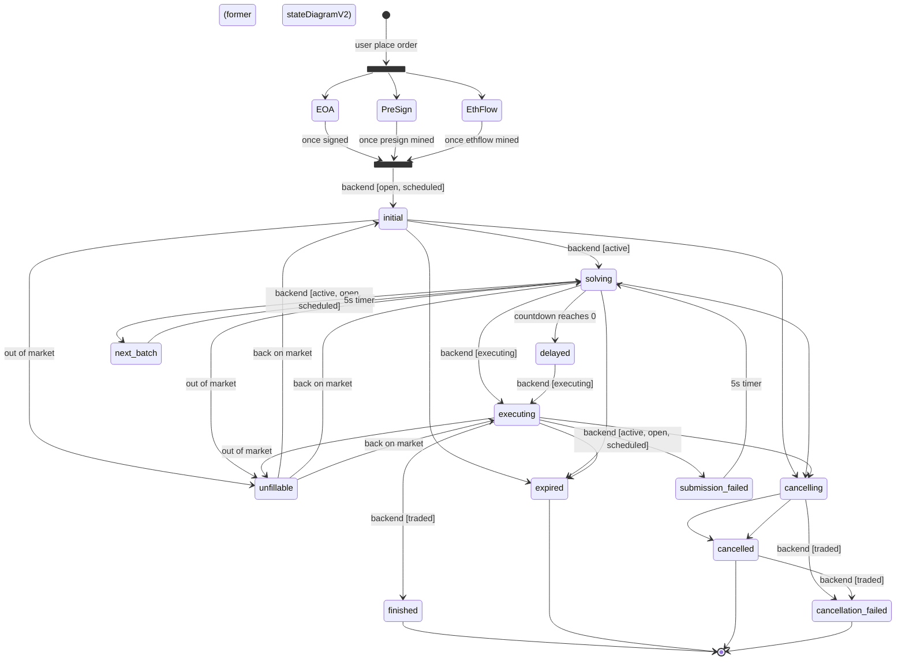

# Progress bar flow

```mermaid

stateDiagram (former stateDiagramV2)
    state place_order <<fork>>
        [*] --> place_order: user place order
        place_order --> EOA
        place_order --> PreSign
        place_order --> EthFlow

    state pending_order <<join>>
        EOA --> pending_order: once signed
        PreSign --> pending_order: once presign mined
        EthFlow --> pending_order: once ethflow mined

        state initial
            pending_order --> initial: backend [open, scheduled]
        state solving
            initial --> solving: backend [active]
        state executing
            solving --> executing: backend [executing]
        state finished
            executing --> finished: backend [traded]
            finished --> [*]

        state delayed
            solving --> delayed: countdown reaches 0
            delayed --> executing: backend [executing]
        state unfillable
            initial --> unfillable: out of market
            solving --> unfillable: out of market
            executing --> unfillable: out of market
            unfillable --> initial: back on market
            unfillable --> solving: back on market
            unfillable --> executing: back on market
        state expired
            initial --> expired
            solving --> expired
            executing --> expired
            expired --> [*]
        state cancelling
            initial --> cancelling
            solving --> cancelling
            executing --> cancelling
            cancelling --> cancelled
            cancelling --> cancellation_failed: backend [traded]
        state cancelled
            cancelling --> cancelled
            cancelled --> cancellation_failed: backend [traded]
            cancelled --> [*]
        state cancellation_failed
            cancellation_failed --> [*]
        state submission_failed
            executing --> submission_failed: backend [active, open, scheduled]
            submission_failed --> solving: 5s timer
        state next_batch
            solving --> next_batch: backend [active, open, scheduled]
            next_batch --> solving: 5s timer
```
