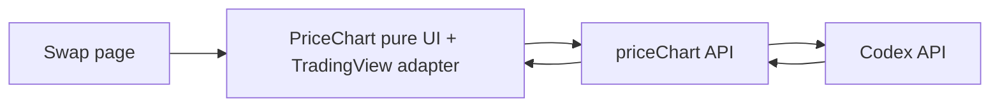

# Price chart

## 1) Purpose

Provide a single app-local integration point for historical OHLCV price data used by the swap chart.

This module owns the Codex fetcher, request normalization, response validation, low-volume diagnostics, and the swap-owned pure chart component.

## 2) Responsibilities

- Fetch token bar history from Codex via `@codex-data/sdk`
- Normalize frontend query params into Codex request params
- Validate Codex responses before chart code consumes them
- Map Codex bar arrays into app-friendly `PriceChartBar[]`
- Log fetch start/success/failure through `logPriceChart`

## 3) Product decisions

- This module owns the only swap price chart surface
- The chart is mounted on the Swap page right column via `TradePageLayout`
- The available symbols are exactly four swap-derived markets:
  - `sellToken/USD`
  - `buyToken/USD`
  - `sellToken/buyToken`
  - `buyToken/sellToken`
- The default symbol is `sellToken/buyToken`
- Symbol search is intentionally disabled; symbol selection happens through local buttons only
- The selected local button format is persisted in local storage as `1 | 2 | 3 | 4`:
  - `1`: `sellToken/USD`
  - `2`: `buyToken/USD`
  - `3`: `sellToken/buyToken`
  - `4`: `buyToken/sellToken`
- Pair history is attempted directly; when unavailable, the chart shows a local not-found overlay
- Native assets must be resolved to wrapped token addresses before reaching Codex
- TradingView backfill requests are intentionally disabled; only the first history request is sent to Codex
- Chart status is scoped to the active ticker so stale responses cannot leak banner/overlay state across symbol switches
- Chart layout, drawings, and selected format are restored from local storage on load and auto-saved back to local storage

## 4) Internal structure

- `api/`: Codex fetching + logging
- `lib/`: TradingView adapter/runtime glue + shared types/constants
- `pure/`: chart UI owned by Swap

## 5) Data flow

The `PriceChart` component requests historical bars from this module's API layer.

The API layer talks to Codex.

The API layer returns normalized bars or throws a typed error path back to the caller.

## 6) Request model

The public entry point is `fetchPriceChartData(params)`.

Inputs:

- `address`
- `chainId`
- `from`
- `to`
- `resolution`
- `currencyCode`
- optional `countback`
- optional empty/null trimming flags

Codex symbol format:

- `${address}:${chainId}`

Important:

- Native assets must be resolved to their wrapped token address before they reach this module
- This module expects a real token contract address, not the `0xeeee...` native sentinel

## 7) Response model

Codex returns array-shaped bar data.

This module:

- rejects inconsistent array lengths
- drops bars with null OHLC fields
- preserves bar time as Unix seconds
- leaves TradingView-specific adaptation to the caller

## 8) Runtime behavior

- WS is disabled
- requests use `fetchWithTimeout`
- no realtime streaming
- no broad symbol-search UX
- no multi-exchange routing or comparison
- TradingView state persistence uses `saved_data` on init and `onAutoSaveNeeded` plus unmount save for local storage
- Selected format persistence uses `priceChartFormat:v0`
- API key resolution order:
  1. `CODEX_API_KEY_ENV`
  2. `LEGACY_DEFINED_API_KEY_ENV`
  3. built-in fallback test key

## 9) File structure

- `api/`
- `api/fetchPriceChartData.ts`: public Codex fetcher
- `api/logPriceChart.ts`: scoped diagnostics
- `lib/priceChart.types.ts`: query + bar types
- `lib/priceChart.constants.ts`: env names, timeout, fallback key
- `lib/tradingView*.ts`: TradingView adapter/datafeed glue
- `lib/tradingViewPersistence.utils.ts`: local storage save/load helpers for chart state
- `lib/symbolCatalog.ts`: swap-derived chart symbols
- `lib/charting_library/`: vendored TradingView runtime types/loader
- `pure/PriceChart/PriceChart.container.tsx`
- `pure/PriceChart/PriceChart.pure.tsx`
- `pure/PriceChart/PriceChart.styled.ts`

## 10) Verification

Focused tests exist for:

- Codex fetcher behavior
- TradingView adapter behavior
- TradingView datafeed behavior
- swap-derived symbol catalog behavior

## 11) Architecture note

`priceChart` now owns both:

- the price-history API boundary
- the swap-owned pure chart component

The internal split is:

- `api/` for external data fetching
- `lib/` for adapter/runtime helpers
- `pure/` for UI

This is a better fit than the old `modules/proChart` naming, which described implementation style instead of ownership.
