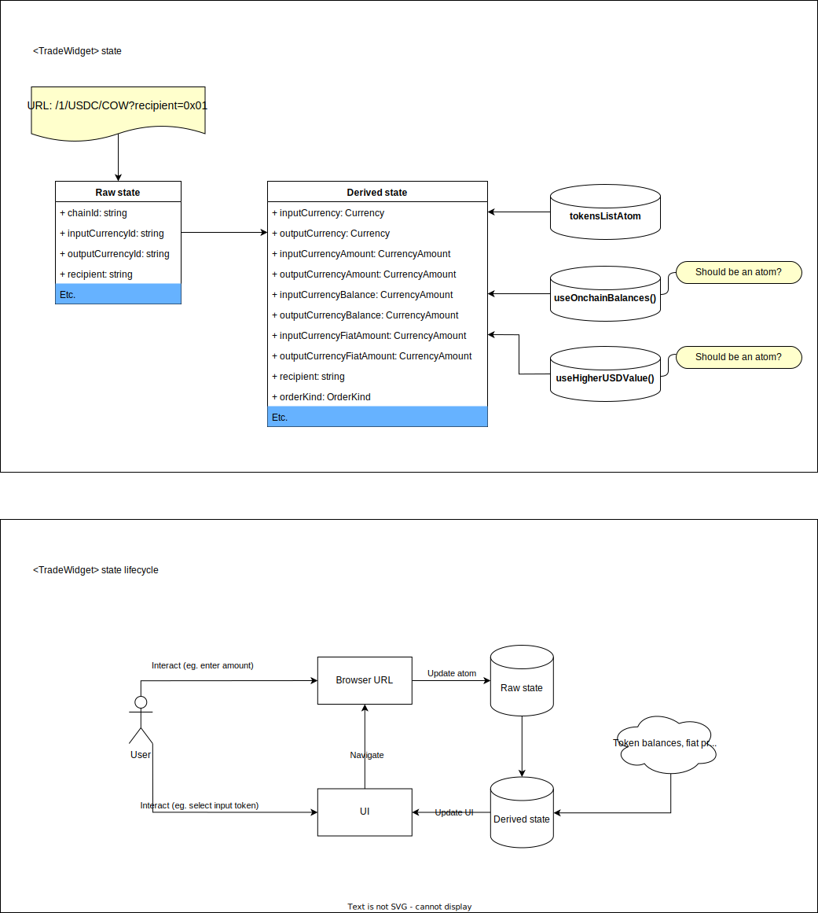
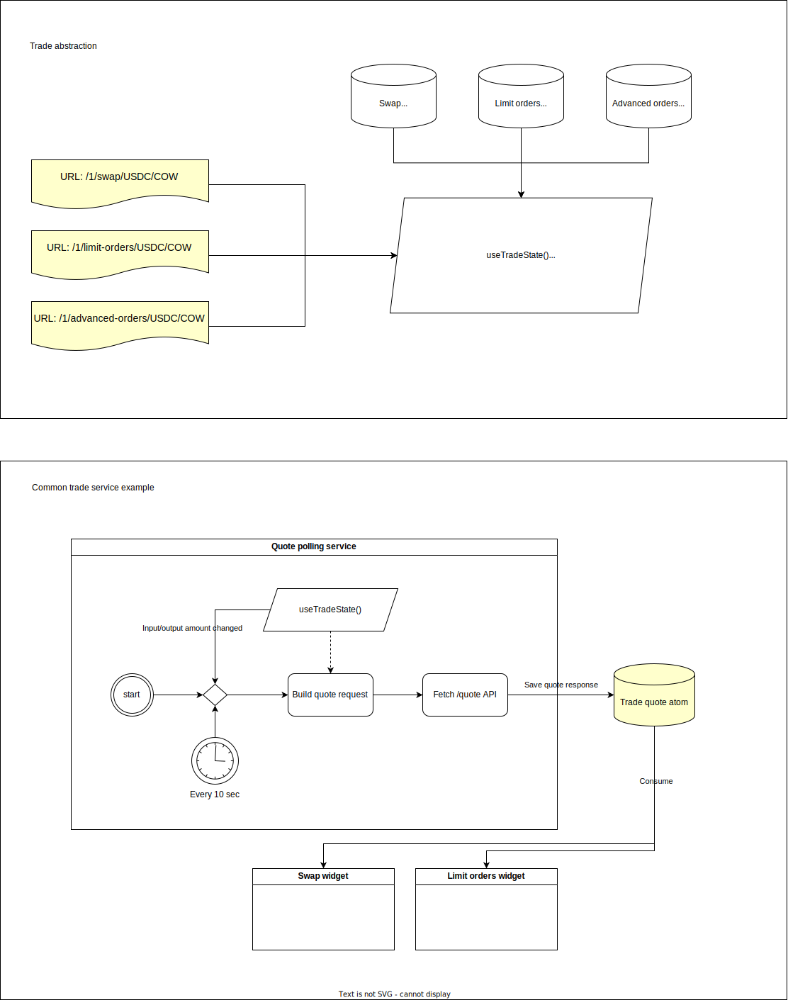

# Trade module

## Problem statement

Since we have at least three trade widgets we need to unify their logic and avoid code duplication ([DRY](https://en.wikipedia.org/wiki/Don%27t_repeat_yourself)). To do this, we need to define what is specific and what is common.
At the same time, strike a balance between code cohesion and solution scalability.

## Shared language

- `TradeWidget` - Widget to create CoW orders. Its configuration can create many different ways to create orders, for example Swap, Limit Orders and Advanced orders will be instances of it
- `TradeRawState` - DTO derived from URL (`/1/USDT/WETH?recipient=0x000`) and persisted into localStorage ([ref](../../../modules/trade/types/TradeRawState.ts))
- `TradeDerivedState` - a model that contains `CurrencyAmount` and `Currency` instances. This state is derived from TradeRawState ([ref](../../../modules/trade/types/TradeDerivedState.ts))

## Concept of TradeWidget

1. Each trade widget: [SwapWidget](../../swap/containers/SwapWidget/index.tsx), [LimitOrdersWidget](../../../modules/limitOrders/containers/LimitOrdersWidget/index.tsx), [AdvancedOrdersWidget](../../../modules/advancedOrders/containers/AdvancedOrdersWidget/index.tsx) uses [TradeWidget](../../../modules/trade/containers/TradeWidget/index.tsx) as a skeleton to get out of the box:
   1. State persistence with URL
   2. Tokens selection and `setMax` functionality
   3. Recipient input
   4. Token importing
   5. Token approving
2. Simultaneously, `TradeWidget` allows customizing a widget layout using `TradeWidgetSlots` ([ref](../../../modules/trade/containers/TradeWidget/index.tsx#L33)) and other parameters.
3. `useTradeState()` hook serves to **generalize** trade states. It returns the current trade widgets raw state depending on what widget is open now. _We take as a fact that we can have only one trade widget on the page at one point in time._
   1. This hook is supposed to be a base for **shared trade services** (by service I mean component, hook, updater, atom, etc.)
4. `Shared trade services` - these are tools that allow you to work with any trade widgets without requiring you to know the type of this widget
   1. Example: `useIsWrapOrUnwrap()` - the hook returns true when a trade state is ETH/WETH or WETH/ETH. And you can call it from everywhere in the App and it will give the result relative to the current widget (swap/limit orders/advanced orders)

## TradeWidget structure diagram (sub-modules)

## State diagram

## Abstraction diagram

