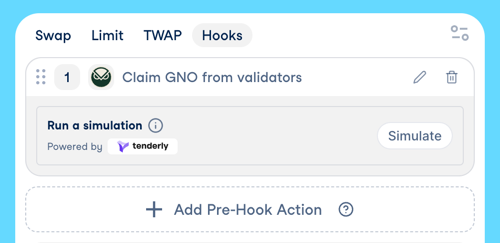

# CoW Protocol hooks

>CoW Hooks allow users to call arbitrary Ethereum action before and/or after swap.  
>For example: before swap give a permission to CoW Protocol smart-contract and after swap bridge tokens to another chain.

### Docs: https://docs.cow.fi/cow-protocol/tutorials/hook-dapp



## CoW Hooks Dapp library

[CoW Swap](https://swap.cow.fi/) provides an opportunity to use external dapps to build hooks.  
So, you can put a link to some hook-daap and it will be automatically integrate in CoW Swap!

This library is for developers who are interested in developing dapps for CoW Hooks.
It provides:
 - `EIP-1193` provider to interact with a user wallet
 - `HookDappContext` which contains environment parameters (chainId, account, etc.) and current order parameters (sell token, validTo, etc.)

And it expects calling two callbacks:
 - `addHook()` when a hook data is ready and can be added to an order
 - `editHook()` when hook parameters were changed

## Quick start

```
npm install @cowprotocol/hook-dapp-lib --save
```

```
yarn add @cowprotocol/hook-dapp-lib
```

Let's create a simple hook-dapp that will check the COW token balance of the order creator.

```html
<html>
  <body>
  <button id="actionButton">Add hook</button>

  <script>
    import { initCoWHookDapp, HookDappContext } from '@cowprotocol/hook-dapp-lib'

    const COW_TOKEN_ADDRESS = '0xdef1ca1fb7fbcdc777520aa7f396b4e015f497ab'
    // ERC20.balanceOf(account)
    const CALL_DATA = (account: string) => `0x70a08231000000000000000000000000${account.slice(2)}`
    
    let context: HookDappContext | null = null
  
    const { actions } = initCoWHookDapp({ onContext: (_context) => context = _context })
    
    document.getElementById('actionButton').addEventListener('click', () => {
      if (!context) {
        console.log('App is not loaded yet, please wait a bit.')
        return
      }
      
      if (context.hookToEdit) {
        // Implement a logic for editing an existing hook
        // And call actions.editHook() with new parameters
      }

      actions.addHook({
        hook: {
          target: COW_TOKEN_ADDRESS,
          callData: CALL_DATA(context.account),
          gasLimit: '32000'
        }
      })
    })
  </script>
  </body>
</html>
```

## Developers

#### Test

```
nx test hook-dapp-lib
```

#### Build the library

```
nx build hook-dapp-lib
```
