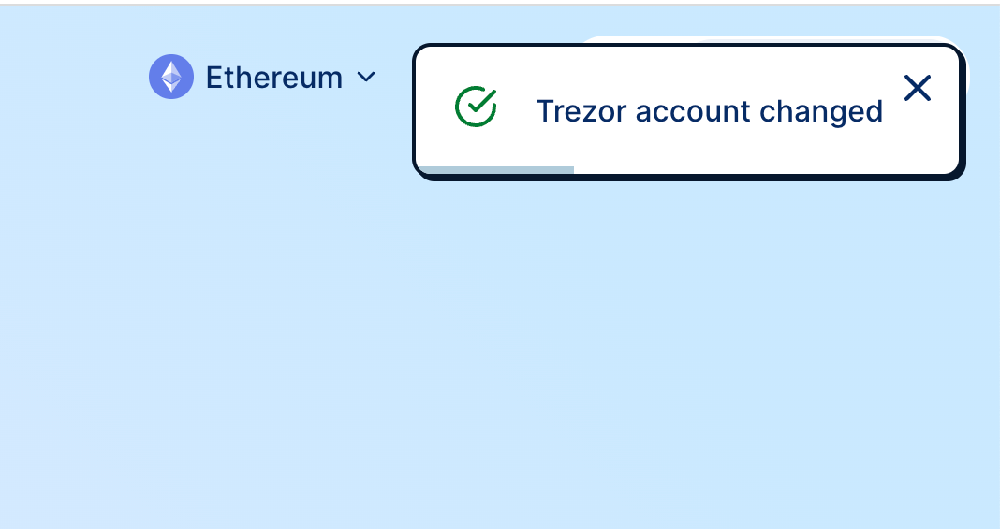

# Snackbars



## Usage

```tsx
// Add the widget in the root component

import { SnackbarsWidget } from '@cowswap/snackbars'

export function App() {
  return (
    <SomProvider>
      <MyComponent />
      <SnackbarsWidget />
    </SomProvider>
  )
}
```

```tsx
// Use the hook to add a snackbar

import { useAddSnackbar } from '@cowswap/snackbars'

export function MyComponent() {
  const addSnackbar = useAddSnackbar()

  addSnackbar({
    content: <Trans>{walletName} account changed</Trans>,
    id: 'account-changed',
    icon: 'success'
  })
}
```

This library was generated with [Nx](https://nx.dev).

## Running unit tests

Run `nx test snackbars` to execute the unit tests via [Vitest](https://vitest.dev/).
