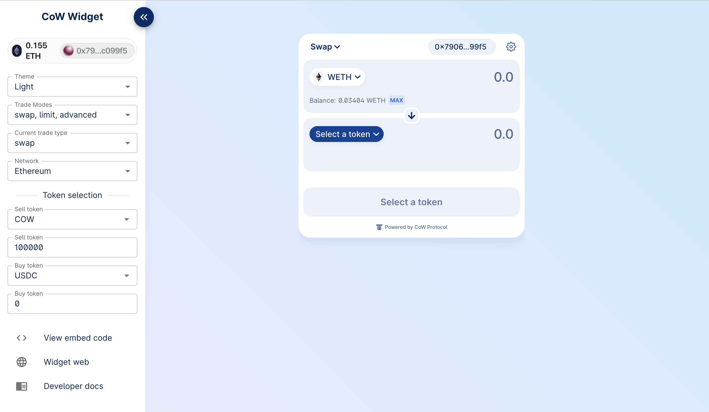

# CoW Swap Widget

Integrate the power of `CoW Swap` into your product!
With the widget, you can create an incredible trading interface. Specify the required pair of currencies, customize the
look and much more!

Create your own widget using the configurator https://widget.cow.fi



## Install

```bash
yarn add @cowprotocol/widget-lib
```

```bash
npm install @cowprotocol/widget-lib
```

## Quick start

```typescript
import {cowSwapWidget, CowSwapWidgetParams} from '@cowprotocol/widget-lib'

// HTML element where the widget will be rendered
const widgetContainer = document.getElementById('cowswap-widget')

const params: CowSwapWidgetParams = {
  appKey: 'YOUR_APP_ID',
  width: 600,
  height: 640,
  sell: {asset: 'DAI'},
  buy: {asset: 'USDC', amount: '0.1'}
}

cowSwapWidget(widgetContainer, params)
```

## App key

You must specify the `appKey` parameter when initializing the widget. This parameter is used to identify the source of
orders.  
The key must be a UTF8 string of up to 50 chars.  
It will be a part of orders meta-data, see more in
the [CoW Protocol Docs](https://docs.cow.fi/front-end/creating-app-ids/create-the-order-meta-data-file/appcode).

## Partner fee

If your business model involves charging a fee for trading, you can easily do this by adding just one parameter:

```typescript
import {cowSwapWidget, CowSwapWidgetParams} from '@cowprotocol/widget-lib'

const widgetContainer = document.getElementById('cowswap-widget')

const params: CowSwapWidgetParams = {
  partnerFeeBips: '50' // 0.5%
}

cowSwapWidget(widgetContainer, params)
```

> **Coming soon, please get in touch to sign up to the beta program: TODO-TYPEFORM**

## Wallet provider

You can pass the wallet provider from your application to seamlessly use the widget as part of your application.
Also, you can not specify the provider, in this case the widget will work in standalone mode with the ability to connect
any wallet supported in CoW Swap.

A provider must comply with [EIP-1193](https://eips.ethereum.org/EIPS/eip-11930) and implement the interface:

```typescript
interface EthereumProvider {
  on(event: string, args: unknown): void

  request<T>(params: JsonRpcRequest): Promise<T>

  enable(): Promise<void>
}

interface JsonRpcRequest {
  id: number
  method: string
  params: unknown[]
}
```

An example of connecting a widget to Rabby Wallet or Metamask:

```typescript
import {cowSwapWidget, CowSwapWidgetParams} from '@cowprotocol/widget-lib'

cowSwapWidget(
  document.getElementById('cowswap-widget'),
  {
    provider: window.ethereum // <-------
  }
)
```

## Configuration

### `CowSwapWidgetParams`

> All params are optional

| Parameter             | Type                   | Default                   | Description                                                                                                                                                                                        |
|-----------------------|------------------------|---------------------------|----------------------------------------------------------------------------------------------------------------------------------------------------------------------------------------------------|
| `width`               | `string`               | 400px                     | The width of the widget in css values (px, vh, etc.).                                                                                                                                              |
| `height`              | `string`               | 600px                     | The height of the widget in css values (px, vh, etc.).                                                                                                                                             |
| `appKey`              | `string`               | 'DEFAULT_INJECTED_WIDGET' | The unique identifier of the widget consumer. Please fill the for to let us know a little about you: TODO-TYPEFORM                                                                                 |
| `provider`            | `EthereumProvider`     | ---                       | The Ethereum provider to be used for interacting with a wallet. To connect, for example, to Rabby Wallet or Metamask, just set `window.ethereum`. You also might like to use https://web3modal.com |
| `chainId`             | `number`               | 1                         | The blockchain ID on which the trade will take place.  Currently supported: 1 (Mainnet), 5 (Goerli), 100 (Gnosis chain)                                                                            |
| `tradeType`           | `TradeType`            | 'swap'                    | The type of trade. Can be `swap` or `limit` or `advanced`.                                                                                                                                         |
| `env`                 | `CowSwapWidgetEnv`     | 'prod'                    | The environment of the widget (`local` , `prod` , `dev` , `pr`). See [`COWSWAP_URLS`](https://github.com/cowprotocol/cowswap/blob/develop/libs/widget-lib/src/consts.ts) const value for urls.     |
| `tradeAssets`         | `TradeAssets`          | Same as in swap.cow.fi    | An object containing information about the selling and buying assets. Example: `{ asset: 'WBTC', amount: 12 }` or `{ asset: '0xa0b86991c6218b36c1d19d4a2e9eb0ce3606eb48' }`                        |
| `theme`               | `CowSwapTheme`         | 'light'                   | The theme of the widget (`'dark'` for dark theme or `'light'` for light theme).                                                                                                                    |
| `logoUrl`             | `string`               | ---                       | Allows to set a custom logo for the widget.                                                                                                                                                        |
| `hideLogo`            | `boolean`              | false                     | Option to hide the logo in the widget.                                                                                                                                                             |
| `hideNetworkSelector` | `boolean`              | false                     | Disables an opportunity to change the network from the widget UI.                                                                                                                                  |
| `enabledTradeTypes`   | `Array<TradeType>`     | All are enabled           | CoW Swap provides three trading widgets: `swap`, `limit` and `advanced` orders. Using this option you can narrow down the list of available trading widgets.                                       |
| `palette`             | `CowSwapWidgetPalette` | ---                       | Using the palette you can customize the appearance of the widget. For example, you can change the main color of the background and text.                                                           |
| `partnerFeeBips`      | `string`               | ---                       | Coming soon! You can enable a fee for all trades in the widget. Please contact TODO-TYPEFORM to enable your partner fee.                                                                           |

## Widget updating

You can change all possible widget options on the fly:

```typescript
import {cowSwapWidget, CowSwapWidgetParams} from '@cowprotocol/widget-lib'

const container = document.getElementById('cowswap-widget')

const params: CowSwapWidgetParams = {
  appKey: 'YOUR_APP_ID',
  logoUrl: 'YOUR_LOGO_URL'
}

const updateWidget = cowSwapWidget(container, params)

// Update the widget
updateWidget({
  ...params,
  theme: 'dark', // <- Change theme to dark
  hideNetworkSelector: true // <- Hide the network selector
})
```

## Widget URL

Most of the widget parameters are controlled via the URL, which means that you can create the URL yourself and embed the
iframe.
An example of URL:

```
https://swap.cow.fi/#/100/swap/WXDAI/GNO?sellAmount=200&theme=dark
```
