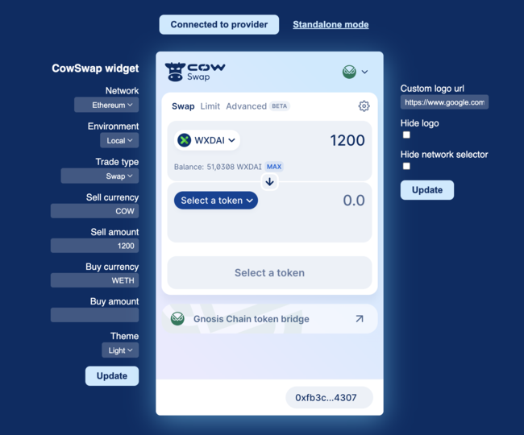

# CowSwap Widget

Integrate the power of `CowSwap` into your product!
With the widget, you can create an incredible trading interface. Specify the required pair of currencies, customize the
look and much more!

[](https://www.youtube.com/watch?v=gxRRH9Rumx4&ab_channel=CoWSwap)

> [Watch the demo](https://www.youtube.com/watch?v=gxRRH9Rumx4&ab_channel=CoWSwap)

## Install

```bash
yarn add @cowprotocol/widget-lib
```

```bash
npm install @cowprotocol/widget-lib
```

## Quick start

```typescript
import { cowSwapWidget, CowSwapWidgetParams, CowSwapWidgetSettings } from '@cowprotocol/widget-lib'

// Initialise the widget
const widgetContainer = document.getElementById('cowswap-widget')

const params: CowSwapWidgetParams = {
  container: widgetContainer,
  metaData: { appKey: 'YOUR_APP_ID', url: 'https://YOUR_APP_URL' },
  width: 600,
  height: 640,
}

const settings: CowSwapWidgetSettings = {
  urlParams: {
    sell: { asset: 'DAI' },
    buy: { asset: 'USDC', amount: '0.1' }
  }
}

cowSwapWidget(params, settings)
```

## Wallet provider

You can pass the wallet provider from your application to seamlessly use the widget as part of your application.
Also, you can not specify the provider, in this case the widget will work in standalone mode with the ability to connect
any wallet supported in CowSwap.

A provider must comply with [EIP-1193](https://eips.ethereum.org/EIPS/eip-11930) and implement the interface:

```typescript
interface EthereumProvider {
  on(event: string, args: unknown): void

  request<T>(params: JsonRpcRequest): Promise<T>

  enable(): Promise<void>
}

interface JsonRpcRequest {
  id: number
  method: string
  params: unknown[]
}
```

An example of connecting a widget to Metamask:

```typescript
import { cowSwapWidget, CowSwapWidgetParams } from '@cowprotocol/widget-lib'

const params: CowSwapWidgetParams = {
  container: document.getElementById('cowswap-widget'),
  metaData: { appKey: 'YOUR_APP_ID', url: 'https://YOUR_APP_URL' },
  width: 600,
  height: 640,
  provider: window.ethereum // <-------
}

cowSwapWidget(params, {})
```

## Configuration

### `CowSwapWidgetParams`

| Parameter   | Type                    | Description                                                                                                                                          |
|-------------|-------------------------|------------------------------------------------------------------------------------------------------------------------------------------------------|
| `width`     | `number`                | The width of the widget in pixels.                                                                                                                   |
| `height`    | `number`                | The height of the widget in pixels.                                                                                                                  |
| `container` | `HTMLElement`           | The container in which the widget will be displayed.                                                                                                 |
| `metaData`  | `CowSwapWidgetMetaData` | Information about the application in which the widget is embedded. This information will help identify the source of orders and requests from users. |
| `provider`  | `EthereumProvider`      | (Optional) The Ethereum provider to be used for interacting with a wallet.                                                                           |

### `CowSwapWidgetSettings`

| Parameter   | Type                     | Description                                                                                                                     |
|-------------|--------------------------|---------------------------------------------------------------------------------------------------------------------------------|
| `urlParams` | `CowSwapWidgetUrlParams` | The URL parameters of the widget, including chain information, trade type, environment, assets, and theme.                      |
| `appParams` | `CowSwapWidgetAppParams` | (Optional) The application parameters of the widget, including the logo URL and flags for hiding the logo and network selector. |

### `CowSwapWidgetUrlParams`

| Parameter     | Type               | Description                                                                                |
|---------------|--------------------|--------------------------------------------------------------------------------------------|
| `chainId`     | `number`           | The blockchain ID on which the trade will take place.                                      |
| `tradeType`   | `string`           | The type of trade. Can be `swap` or `limit-orders`.                                        |
| `env`         | `CowSwapWidgetEnv` | The environment of the widget (`'local'` or `'prod'`).                                     |
| `theme`       | `CowSwapTheme`     | (Optional) The theme of the widget (`'dark'` for dark theme or `'light'` for light theme). |
| `tradeAssets` | `TradeAssets`      | (Optional) An object containing information about the selling and buying assets.           |

```typescript
interface TradeAsset {
  asset: string
  amount?: string
}

export interface TradeAssets {
  sell: TradeAsset
  buy: TradeAsset
}
```

### `CowSwapWidgetAppParams`

| Parameter             | Type      | Description                                          |
|-----------------------|-----------|------------------------------------------------------|
| `logoUrl`             | `boolean` | The width of the widget in pixels.                   |
| `hideLogo`            | `boolean` | The height of the widget in pixels.                  |
| `hideNetworkSelector` | `boolean` | The container in which the widget will be displayed. |

## Widget updating

You can change all possible widget options on the fly:

```typescript
import { cowSwapWidget, CowSwapWidgetParams, CowSwapWidgetSettings } from '@cowprotocol/widget-lib'

const params: CowSwapWidgetParams = {
  container: document.getElementById('cowswap-widget'),
  metaData: { appKey: 'YOUR_APP_ID', url: 'https://YOUR_APP_URL' },
  width: 600,
  height: 640,
}


const settings: CowSwapWidgetSettings = {
  appParams: {
    logoUrl: 'YOUR_LOGO_URL'
  }
}

const updateWidget = cowSwapWidget(params, settings)

// Update the widget
updateWidget({
  urlParams: {
    theme: 'dark', // <- Change theme to dark
  },
  appParams: {
    ...settings.appParams,
    hideNetworkSelector: true // <- Hide the network selector
  },
})
```

## Widget URL

Most of the widget parameters are controlled via the URL, which means that you can create the URL yourself and embed the
iframe.
An example of URL:

```
https://swap.cow.fi/#/100/swap/WXDAI/GNO?sellAmount=200&theme=dark
```

## Backlog

1. [ ] Customizing the theme palette
2. [ ] Set custom tokens list from URL or JSON
3. [ ] Forward integrator meta-data to Appzi
